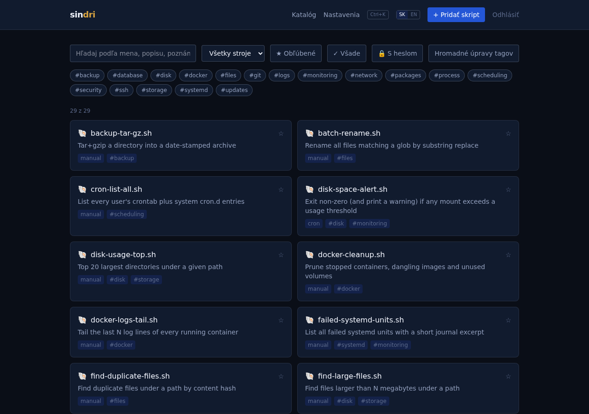
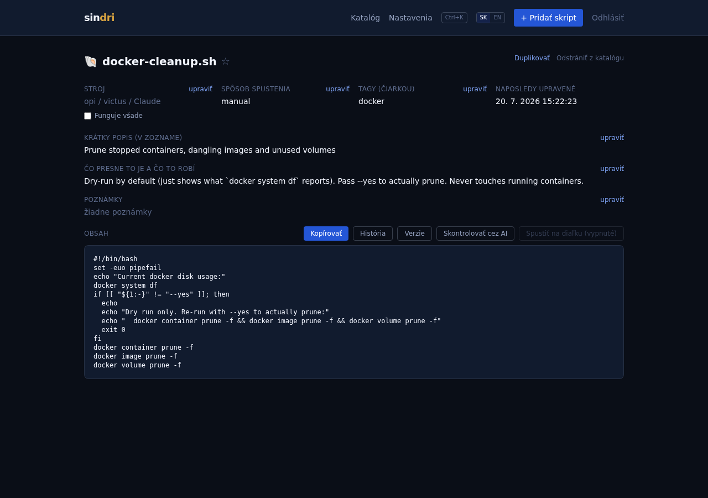
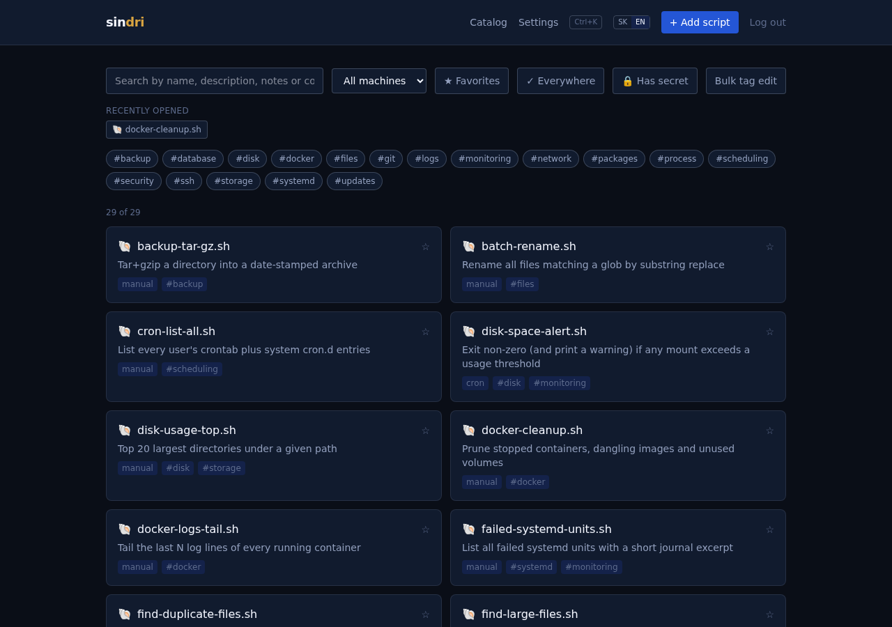

# Sindri

Self-hosted katalóg skriptov — prehľadávanie (aj podľa toho, čo skript
robí, nie len podľa mena), import existujúcich skriptov (výberom z
prehľadaného priečinka, alebo vložením obsahu), voliteľné AI generovanie
a review (cez existujúce `claude`/`codex` CLI prihlásenie, alebo
Anthropic API kľúč), a **~119 vstavaných skriptov/referencií ako
štartovací balík** (~29 univerzálnych Linux admin skriptov + ~90-položkový
cheatsheet naprieč Docker/systemd/git/sieťovou diagnostikou/Windows-
PowerShell/macOS/Python/databázami a ďalším). Rozhranie je dvojjazyčné
(slovenčina/angličtina, prepínač v hlavičke).

Meno po Sindrim, trpasličom kováčovi zo severskej mytológie, ktorý
vykoval Mjölnir a ďalšie legendárne artefakty pre bohov.

<p float="left">
  
  
</p>
<p float="left">
  
</p>

## Rýchly štart

```bash
cp .env.example .env   # uprav SINDRI_PASSWORD
docker compose up -d --build
```

Appka beží na `http://localhost:8420` (port nastaviteľný cez
`SINDRI_PORT` v `.env`). Voliteľné funkcie (AI, sandbox, vzdialené
spustenie) majú vlastné zapínacie kroky — pozri `docs/AI_FEATURES.md`,
`docs/SANDBOX.md`, `docs/REMOTE_EXEC.md`.

## Čo appka vie

- **Katalóg**: hľadanie/filter podľa stroja a klikacích tag chipov
  (multi-select), fulltext hľadanie aj v obsahu skriptu (nielen v
  mene/popise), zoskupovanie referenčných zbierok (cheatsheet/pentest)
  do skladacích kategórií, zvýrazňovanie syntaxe pri zobrazení obsahu.
- **Import**: prehľadaj priečinok (lokálny mount) a vyber, ktoré skripty
  pridať (s varovaním, ak niektorý vyzerá, že obsahuje heslo/token),
  alebo vlož obsah ručne — obe cesty aj cez SSH na registrovaný vzdialený
  stroj.
- **AI generovanie/review** (voliteľné, appka funguje aj bez toho): pozri
  `docs/AI_FEATURES.md`.
- **Sandbox testovanie** (voliteľné, vypnuté defaultne): izolovaný
  jednorazový kontajner bez siete/s limitmi, pozri `docs/SANDBOX.md`.
- **Vzdialené spustenie cez SSH** (voliteľné, vypnuté defaultne):
  spustí skript na zaregistrovanom stroji (jednotlivo alebo naraz na
  všetkých), sudo heslo (ak treba) sa zadáva nanovo pri každom behu,
  nikdy sa neukladá — pozri `docs/REMOTE_EXEC.md`.
- **Push naspäť**: prepíše zdrojový súbor na registrovanom stroji
  aktuálnym obsahom z katalógu (opak importu).
- **História obsahu a rollback**: každá zmena obsahu (ručná úprava,
  obnovenie zo zdroja, AI prepis) sa pred prepísaním uloží ako verzia;
  diff proti aktuálnemu obsahu a obnovenie staršej verzie jedným
  klikom, nič sa nikdy nestratí.
- **Obnoviť zo zdroja s diffom**: pre importované skripty zobrazí presne
  čo sa zmenilo od importu (pridané/odobrané riadky), nielen "zmenilo
  sa áno/nie".
- **Detekcia osirelých záznamov**: skontroluje, či zdrojový súbor
  importovaných skriptov ešte existuje (lokálne priamo, vzdialené cez
  SSH ak je zapnuté vzdialené spustenie).
- **Kontrola plánovania oproti realite**: porovná pole "Spôsob
  spustenia" v katalógu so skutočným `crontab`/systemd timer
  nastavením na registrovaných strojoch — odhalí rozpor medzi tým, čo
  katalóg tvrdí, a čo naozaj beží.
- **Správa tagov**: vlastná stránka na premenovanie/zmazanie tagu
  naprieč celým katalógom na jednom mieste, nielen po jednom skripte.
- **Export katalógu**: celý obsah katalógu ako stiahnuteľný JSON.
- **Prihlásenie s brzdou proti hrubej sile**: 5 zlyhaných pokusov / 15
  min zamkne danú IP adresu.
- **Nastavenia**: register spravovaných strojov, stránkovaný audit log
  (kto/kedy/aký skript/aký stroj, nikdy heslo ani plný výstup), prehľad
  katalógu.

## Štruktúra

- `backend/` — FastAPI + SQLite
- `frontend/` — React + Tailwind, vlastný ľahký i18n (`frontend/src/i18n/`)
- `docs/` — architektonické rozhodnutia a ich dôvody
- `import-sources/` — sem mountuj priečinky, ktoré appka má vedieť
  prehľadávať (pozri `import-sources/README.md`)

## Licencia

Apache License 2.0 — pozri [`LICENSE`](./LICENSE).

## Poznámka ku git politike

Tento repozitár bol dlho zámerne len lokálny (žiadny GitHub remote).
Vedomé rozhodnutie ísť s ním na GitHub (**privátny** repozitár, nie
verejný) padlo 2026-07-20.
