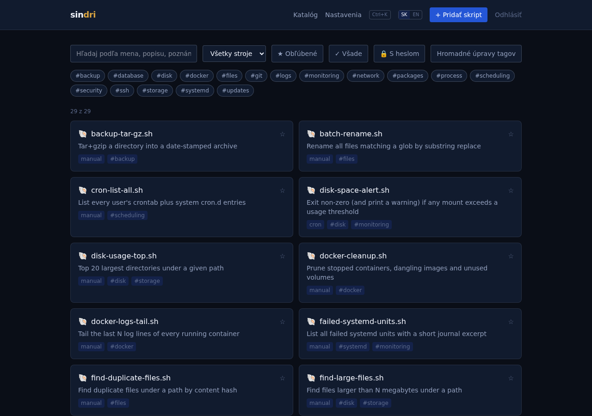
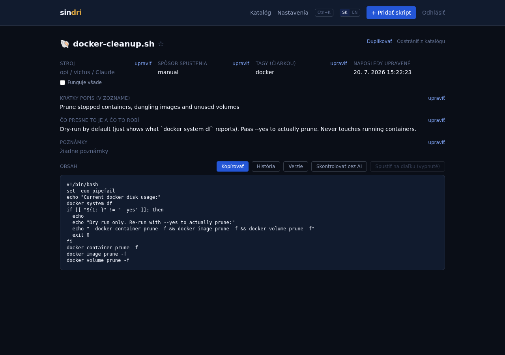
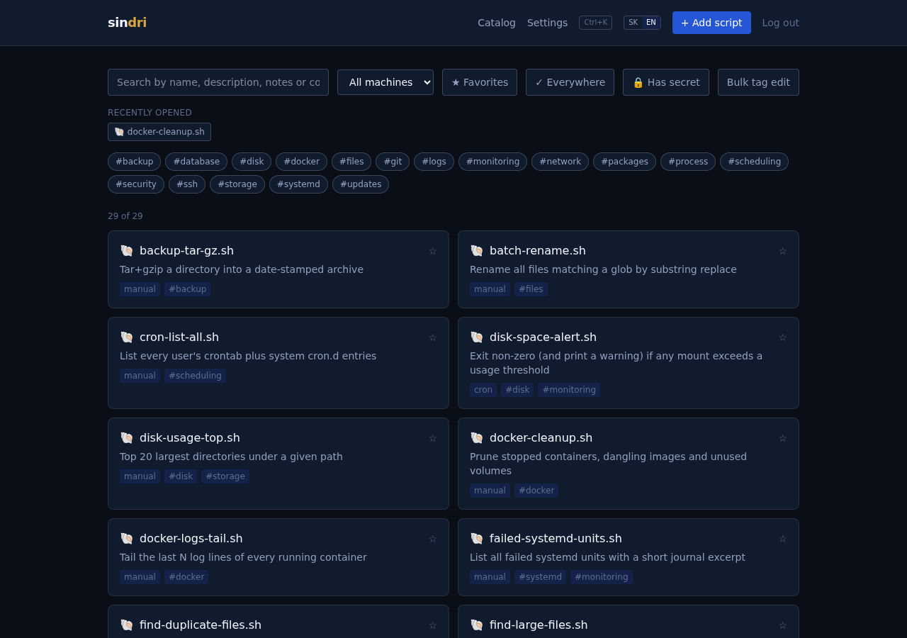

# Sindri

**A self-hosted script operations workspace for Linux and infrastructure** — find a script (even by what it does, not just its name), review and edit it, test it in isolation, push it to the machine it belongs on, run it there, and keep a history of every change.

[](https://github.com/stanleysvk87/sindri/actions/workflows/ci.yml)
[](./LICENSE)

Built-in: ~119 starter scripts/references (~29 generic Linux admin
scripts + a ~90-entry cheatsheet), optional AI generation/review (via an
existing `claude`/`codex` CLI login or an Anthropic API key), and a
bilingual UI (Slovak/English).

Named after Sindri, the dwarven blacksmith from Norse mythology who
forged Mjölnir and other legendary artifacts for the gods.

<p float="left">
  
  
</p>
<p float="left">
  
</p>

## Quick start

```bash
cp .env.example .env   # set SINDRI_PASSWORD
docker compose up -d --build
```

The app runs on `http://localhost:8420` (port configurable via
`SINDRI_PORT` in `.env`). Optional features (AI, sandbox, remote
execution) each have their own enable steps — see `docs/AI_FEATURES.md`,
`docs/SANDBOX.md`, `docs/REMOTE_EXEC.md`.

## What it does

- **Catalog**: search/filter by machine and clickable tag chips
  (multi-select), fulltext search that includes script content (not just
  name/description), reference collections (cheatsheet/pentest) group
  into collapsible categories, syntax highlighting in content view.
- **Import**: scan a folder (local mount) and pick which scripts to add
  (with a warning if one looks like it contains a hardcoded password/
  token), or paste content manually — both paths also work over SSH
  against a registered remote machine.
- **AI generate/review** (optional, the app works fully without it): see
  `docs/AI_FEATURES.md`.
- **Sandbox testing** (optional, off by default): isolated, throwaway
  container with no network/hard limits — see `docs/SANDBOX.md`.
- **Remote execution over SSH** (optional, off by default): runs a
  script on a registered machine (individually or on all of them at
  once); the sudo password (if needed) is entered fresh on every run and
  is never stored — see `docs/REMOTE_EXEC.md`.
- **Push back**: overwrites the source file on a registered machine with
  the current catalog content (the reverse of import).
- **Content history and rollback**: every content change (manual edit,
  restore from source, AI rewrite) is snapshotted as a version before
  being overwritten; diff against the current content and one-click
  restore, nothing is ever lost.
- **Restore from source with a diff**: for imported scripts, shows
  exactly what changed since import (added/removed lines), not just a
  yes/no "changed" flag.
- **Orphaned-record detection**: checks whether the source file of an
  imported script still exists (locally directly, remotely over SSH if
  remote execution is enabled).
- **Schedule-vs-reality check**: compares the catalog's "run mode" field
  against the actual `crontab`/systemd timer setup on registered
  machines — surfaces drift between what the catalog claims and what
  actually runs.
- **Tag management**: a dedicated page to rename/delete a tag across the
  whole catalog in one place, not just per script.
- **Catalog export**: the entire catalog content as a downloadable JSON
  file.
- **Login brute-force lockout**: 5 failed attempts / 15 min locks out
  that client address (see `SINDRI_TRUSTED_PROXIES` below when running
  behind a reverse proxy).
- **Settings**: managed machine registry, paginated audit log (who/when/
  which script/which machine, never the password or full output),
  catalog overview.

## Security model

Sindri is built for a **trusted LAN, VPN, or single-operator homelab** —
**do not put it directly on the public internet.** One shared password
protects everything, and depending on which optional features you turn
on, the backend can hold real power: SSH keys for registered machines,
a Docker socket (sandbox), and AI CLI credentials.

- Auth: one password (PBKDF2-SHA256, 200k iterations), a session cookie
  (`httponly`, `samesite=lax`, `secure` when `SINDRI_COOKIE_SECURE=true`),
  and a brute-force lockout (5 attempts / 15 min). Logging out and
  changing the password both invalidate sessions server-side, not just in
  the browser. No roles, no multi-user, no CSRF token, no TOTP — this is
  a single-operator tool, not a multi-tenant one.
- The lockout is keyed on the client address, which behind a reverse
  proxy is only correct if the proxy is listed in
  `SINDRI_TRUSTED_PROXIES` (the bundled `docker-compose.yml` sets this
  for the frontend container). A forwarded `X-Forwarded-For`/`X-Real-IP`
  is believed **only** from a peer on that list — otherwise any client
  could hand over a made-up address. If you point the list at nothing,
  every request behind the proxy shares one bucket and the lockout
  becomes global rather than per-IP.
- Local scan/import (`/api/scripts/import/scan`, `/import/confirm`) is
  restricted server-side to the configured import root(s)
  (`SINDRI_IMPORT_ALLOWED_ROOTS`, default `/import-sources`) — it cannot
  be pointed at arbitrary container paths.
- Registering a machine with `auth_type=key` validates server-side that
  `ssh_key_path` is one of the keys actually mounted from the host, not
  an arbitrary path supplied by the client.
- Subprocess calls (SSH, sandbox) are built as argv lists, never by
  string-interpolating into a shell command line: script content is
  piped to the remote `bash -s` over **stdin**, so it is never part of
  any command line. Remote *paths* do reach the remote shell inside a
  small fixed command (`base64 <path>`, `find <path> …`), and every one
  of those is `shlex.quote`d first — no unquoted interpolation anywhere.
  The local process is never started with `shell=True`.
- Sudo/SSH passwords are entered fresh per run, sent over stdin (never
  argv, never in `ps` output), never persisted (not in the DB, not in
  the audit log), and scrubbed from any error text before it's returned.
- See `docs/SANDBOX.md` and `docs/REMOTE_EXEC.md` for the full
  reasoning behind each optional feature's trust trade-off.

## Known limitations

- No multi-user support — one shared password for everyone with access.
- No host/path allowlisting on remote execution beyond "the machine is
  registered" — a registered machine's SSH key can run anything the
  target user's shell permissions allow.
- No CSRF protection and no TOTP/2FA. The `secure` cookie flag is off by
  default because the app targets plain-HTTP LAN deployments (a secure
  cookie would never be sent there) — set `SINDRI_COOKIE_SECURE=true` if
  you serve it over HTTPS.
- An Anthropic API key saved from the Settings page is stored in the
  SQLite DB in cleartext (it is never displayed back, but anyone with the
  DB file can read it). Use the `SINDRI_ANTHROPIC_API_KEY` env var if you
  would rather it not live in the database.
- Machines registered with `auth_type=password` need the SSH password on
  every call; the UI only prompts for it in the remote-exec panel, so
  push/rescan/host-status against such a machine currently fail with a
  clear "SSH password is required" error rather than prompting.
- `secret_scan.py` is a loose heuristic ("double-check before sharing"),
  not a real secret scanner — false negatives are expected.
- Sandbox execution requires access to the host's Docker socket, which
  is itself a host-root-equivalent grant — read `docs/SANDBOX.md` before
  enabling it.

## Structure

- `backend/` — FastAPI + SQLite (`backend/tests/` — pytest suite)
- `frontend/` — React + Tailwind, a lightweight custom i18n
  (`frontend/src/i18n/`)
- `docs/` — architectural decisions and the reasoning behind them
- `import-sources/` — mount folders here that the app should be able to
  scan (see `import-sources/README.md`)

## Development

```bash
cd backend && pip install -r requirements-dev.txt && python -m pytest tests/ -v
cd frontend && npm ci && npm run lint && npm run build
```

See [`CONTRIBUTING.md`](./CONTRIBUTING.md) for more, and
[`SECURITY.md`](./SECURITY.md) to report a vulnerability.

## License

Apache License 2.0 — see [`LICENSE`](./LICENSE).

## Note on git history

This repository was deliberately local-only for a long time (no GitHub
remote). The conscious decision to put it on GitHub landed on
2026-07-20.
